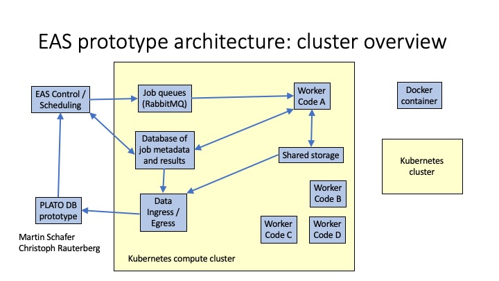

# PLATO WP36 EAS pipeline prototype

The code in this repository is a fully functional prototype of the parallel-computing environment in which we propose to run the PLATO WP36 EAS pipeline.

The pipeline runs in a series of Docker containers within a Kubernetes environment:



The key components are as follows:

* An SQL database (currently MySQL) which holds an index of all of the tasks the pipeline needs to perform, all of the intermediate file products that each task produces, the logs and errors produces by each task, and the dependencies of each task on input file products.
* A message queue (currently RabbitMQ) which holds a job queue of tasks which are ready to be executed. The worker nodes listen to these message queues in order to receive work to do.
* An EAS control module which sits outside the Kubernetes environment, and continually monitors the task database looking for jobs whose input dependencies have been created and have passed QC. When tasks are ready to run, they are fed into the job queues. The EAS control module also deals with the horizontal scaling of the cluster, changing the number of deployed worker nodes capable of running different tasks, based on demand.
* Worker nodes, all derived from a core `eas_base` Docker container, which provides the core code for listening to the message queues and communicating with other components of the EAS system. Most science codes are run in their own separate Docker containers, allowing them to sit up their own custom software environments.
* A web interface (not shown above, based on Python/Flask) allows monitoring of the pipeline's state, and easy access to any error messages, including Python tracebacks from malfunctioning tasks.

### Building the code

The pipeline prototype runs in a series of Docker containers within a
Kubernetes environment. The communications between the containers and with the
outside world is defined via Kubernetes services.

The simplest way to run the pipeline on a single laptop or desktop computer is
by using `minikube`, which provides a simulation environment which is almost
identical to how Kubernetes runs on large clusters.

Instructions on how to deploy the pipeline can be found in `install.md`.

### Usage overview

The pipeline prototype is already a highly capable tool which can be used for
testing the performance of algorithms and techniques on synthetic PLATO
lightcurves.

The following tasks can be performed by the prototype, and sequenced together
to build more complex processes:

* Synthesising lightcurves with PSLS.
* Synthesising lightcurves with Batman.
* Support for PLATOsim is on the way.
* Injecting white noise into lightcurves.
* Importing lightcurves from external sources, including the light-curve stitching group (LCSG) or from the WP38 PLATO-DB prototype.
* Multiplying lightcurves together to inject transits.
* Searching for transits with a range of transit-detection codes, including: BLS, TLS, QATS, (support for DST and EXOTRANS is on the way).
* Lightcurve diagnostics - verifying that lightcurves are readable.
* QC - all tasks are automatically followed-up by a QC task to test whether the output is valid.

Currently all jobs are specified via JSON descriptions, of which there are several examples in the `demo_jobs` directory. This may or may not be a good format to continue using - JSON editors are are plentiful, but the format is rather verbose and full of punctuation.

For example, a request to synthesise a lightcurve for the Earth using PSLS would look as follows:

```
{
  "task": "synthesis_psls",
  "outputs": {
    "lightcurve": "earth.lc"
  },
  "specs": {
    "duration": 730,
    "planet_radius": "(constants.Rearth)",
    "orbital_period": 365,
    "semi_major_axis": 1,
    "orbital_angle": 0,
  }
```

More complex chains of tasks can easily be built by sequencing operations together. Loops, such as for loops and while loops, can be executed using special tasks which perform iterations just like any other task.

### Directory structure

The code in this repository is arranged as follows:

* `build_scripts` -- Convenience scripts which build the Docker containers containing the pipeline prototype.

* `docker_containers` -- Each Docker container used by the pipeline is in a separate directory. The container `eas_base` contains the core pipeline code, and all the other containers are derived from it.

* `eas_controller` -- Scripts used to deploy the prototype into a Kubernetes cluster, and to scale the deployment according to demand. This directory also contains code to initialise the database schema, the job queues, and for submitting jobs to the pipeline.

* `data` -- Storage for input files used by the prototype, for intermediate file products, and for output results.

### List of transit-detection codes

The following transit-detection codes are currently supported by the pipeline prototype:

* **BLS** - Boxed Least Squares.

    Two implementations are supported: the [original FORTRAN implementation](https://github.com/dfm/python-bls) of [Kovacs et al. (2002)](https://ui.adsabs.harvard.edu/abs/2002A%26A...391..369K/abstract), and an [optimised Python implementation](https://github.com/dfm/bls.py) by Dan Forman-Mackey.

* **DST** - Détection Spécialisée de Transits ([Cabrera et al. 2018](https://ui.adsabs.harvard.edu/abs/2012A%26A...548A..44C/abstract))

    This code is not publicly available, and must be obtained from teh author as a tar archive, which is placed in the `private_code` directory.

    Two implementations are supported: versions 26 (C) and version 29 (C++).
    
* **EXOTRANS** ([Grziwa et al. 2012](https://ui.adsabs.harvard.edu/abs/2012MNRAS.420.1045G/abstract))

    This code is not publicly available, and must be obtained from the author. We are awaiting permission from the authors to use it within PLATO.
    
* **QATS** - Quasiperiodic Automated Transit Search ([Carter & Agol 2018](https://ui.adsabs.harvard.edu/abs/2013ApJ...765..132C/abstract))

    This code is publicly available from [Eric Agol's website](https://faculty.washington.edu/agol/QATS/).

* **TLS** - Transit Least Squares ([Hippke & Heller 2019](https://ui.adsabs.harvard.edu/abs/2019A%26A...623A..39H/abstract))

    This code is publicly available from [GitHub](https://github.com/hippke/tls)
    
---

### Author

This code is developed and maintained by Dominic Ford, at the Institute of Astronomy, Cambridge.
