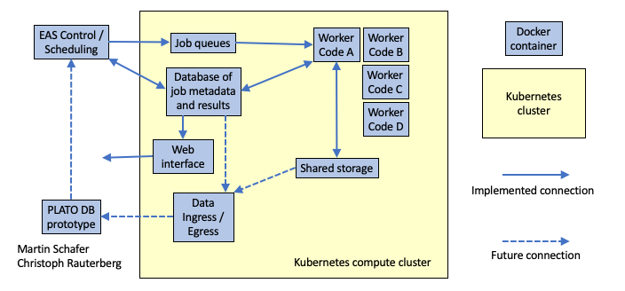
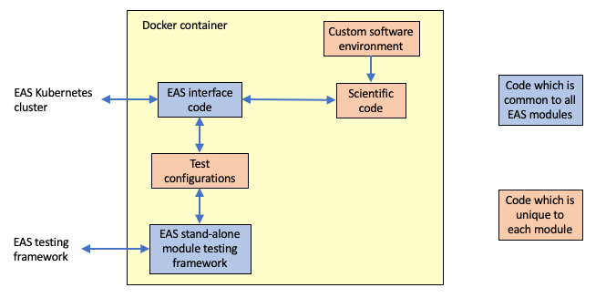

# PLATO WP36 EAS pipeline prototype

* [<< Documentation table of contents](docs/contents.md)

## Introduction

This repository contains a prototype for the software environment in which PLATO WP36 propose to run the PLATO EAS pipeline.

The prototype already contains many fully-functional modules for ingesting lightcurves and running them through science codes such as transit-detection algorithms. It is our intention to implement many more modules within the pipeline over the second half of 2022 - at least in skeleton form - in order to evaluate whether the architecture is flexible enough to meet the pipeline's needs. We hope to perform our first end-to-end data-flow testing of the pipeline by Q2 2023.

The pipeline runs each individual science code within a Docker container, providing it with an entirely isolated software environment. This means that each science code can install their own software dependencies, and it doesn't matter if different science codes require conflicting versions of any particular package. It also makes it (in theory, at least) impossible for science codes to interfere with one another's operations - for example by overwriting temporary working files - since each Docker container provides an entirely isolated file system for each code.

The various Docker containers that make up the pipeline are orchestrated using Kubernetes. Kubernetes is used to instantiate each Docker container when there is work that the science codes within it needs to do, and can increase or decrease the number of instancies of each container when demand is high or low. It manages the resources - CPU, memory, GPUs, etc - on each node within the compute cluster, to ensure that each Docker container has access to the resources it requests. It also provides a virtual network that the containers use to communicate with an external controller to query what work they need to do.

Within each worker container, a core Python module, `plato_wp36`, provides a standard mechanism for communicating with other parts of the pipeline. This includes querying the job queue to find out what work needs doing, fetching the input files needed for each job, and commiting output files into the pipeline's file repository. By using this standard well-tested interface, we can ensure that all the science codes use the task queue and file repository in a consistent manner, while also isolating them from implementation details which may evolve over time.

### Pipeline structure

The diagram below shows the block structure of the pipeline. The yellow block shows the Kubernetes cluster which hosts the pipeline - this may be an instance of `minikube` running on a single laptop, or a large geographically-distributed cluster with thousands of cores. Blue blocks show individual Docker containers running on the cluster, or external components which manage the pipeline:

The key components are as follows:

* **Worker nodes**, as already described above. Each worker may provide a single type of pipeline task, or implement a number of closely-related tasks. A central *task-type register* is responsible for defining what tasks each container is responsible for implementing. The worker nodes run within Docker container that are all derived from a core `eas_base` Docker container. This container provides the core code for listening to the message queues and communicating with other components of the EAS system.

* A **task database**, which holds a list of all the tasks that the pipeline has been requested to perform. It also indexes all the intermediate file products that each task produces, the logs and errors produced by each task, and the dependencies of each task on input file products. This database is the canonical source of information which determines whether a particular task can run right away, or whether it needs to wait for previous tasks to generate required inputs.

* A **job queue**, containing the unique IDs of tasks which are ready to execute. This is populated by EAS Control, and the worker nodes listen to this job queue in order to receive work to do.

* An **EAS control** module which resides outside the Kubernetes environment, and continually monitors the task database
  looking for jobs whose input dependencies have been created and have passed QC. When tasks are ready to run, they are
  fed into the job queues. The EAS control module also manages the horizontal scaling of the cluster, changing the
  number of deployed worker nodes capable of running different tasks, based on demand.

* A **web interface**, based on Python/Flask, which allows monitoring of the pipeline's state and easy access to any error messages, including Python tracebacks from malfunctioning tasks. This runs in its own Docker container, and provides an HTTP service which is exposed on an IP address that is visible outside of the Kubernetes cluster.

### The structure of a worker node

The block diagram below gives an overview of the software environment within each worker's Docker container:

The blue boxes represent code that is shared between all workers, and is provided by the `eas_base` Docker container from which all worker nodes are derived. This provides the core parts of the EAS infrastructure, and handles all communication with other parts of the pipeline.

The orange boxes are unique to each Docker container, and must be provided by the module's implementer.

In addition to providing a science code, and writing a wrapper to allow it to be executed by the EAS interface code, module implementers should also normally provide at least one configuration file which can be used to run the worker container in a stand-alone configuration on supplied test input data.

### Next

* [Documentation table of contents >>](docs/contents.md)

---

## Author

This code is developed and maintained by Dominic Ford, at the Institute of Astronomy, Cambridge.
