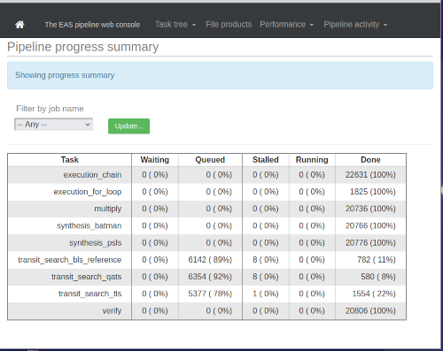
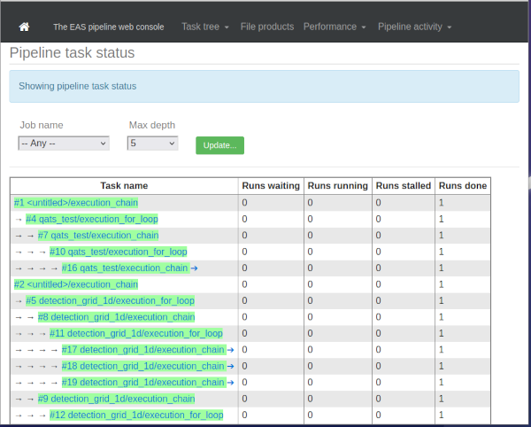
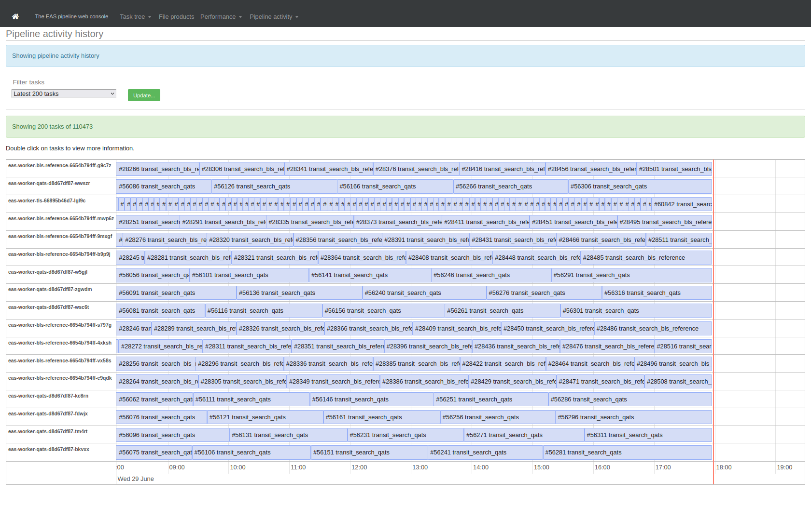

# PLATO WP36 EAS pipeline prototype

* [<< Documentation table of contents](contents.md)

## The EAS web interface

This page describes how to access and use the web interface to the EAS pipeline.

The web interface was built using the Python/Flask framework, running within the `eas_web_interface` Docker container. It is currently in a very rough state, mostly written for the author's own use in debugging, but it provides a dashboard with most of the information that is also available through the [command-line scripts](code_structure_eas_control.md) in the `eas_controller` directory.

||
|:--:|
|**EAS web interface: Pipeline progress summary**|

### Accessing the web interface

The web interface should automatically start running when you deploy the pipeline using the `eas_controller/worker_orchestration/deploy.py`. If you're using `minikube`, then by default it is only accessible on the host machine itself, by connecting to an IP address on a virtual network created by `minikube`. The can discover the IP address and port you need to connect to via the command:

```
minikube service --url eas-web-interface-service -n=plato
```

On a Linux machine, the web address is usually `http://192.168.49.2:5000`. Under macOS, the address is less predictable.

||
|:--:|
|**EAS web interface: Pipeline task hierarchy view**|

### Remote access

If you want to connect to the web interface using a web browser running on a different machine from the one where `minikube` is running, then you need to set up a port forward to expose the web interface on the host machine's public network interfaces. You can do this as follows:

```
kubectl port-forward -n=plato service/eas-web-interface-service 8080:5000  --address='0.0.0.0'
```

You need to leave this command running for as long as you want to access the web interface (and restart it whenever you restart the Docker container containing the web interface code). So it's best to run it in a `screen` session.

You can then access the web interface by connecting to port 8080 on the host machine.

||
|:--:|
|**EAS web interface: Pipeline activity chart, showing pipeline tasks being run by 17 workers**|

---

## Author

This code is developed and maintained by Dominic Ford, at the Institute of Astronomy, Cambridge.
